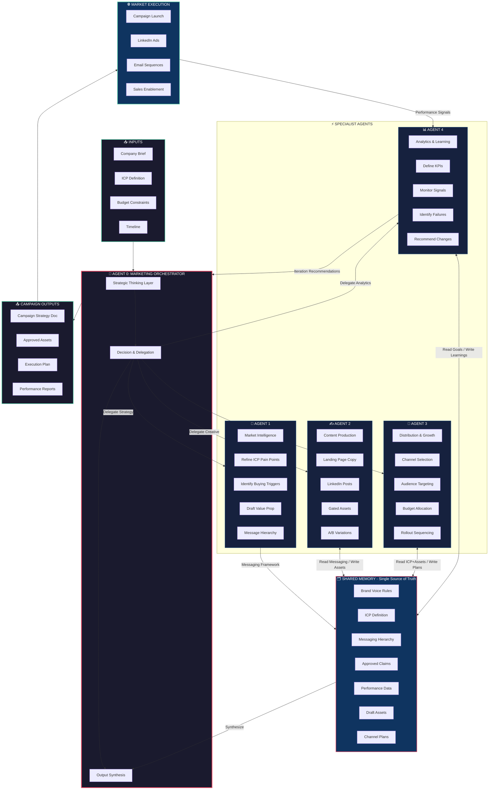
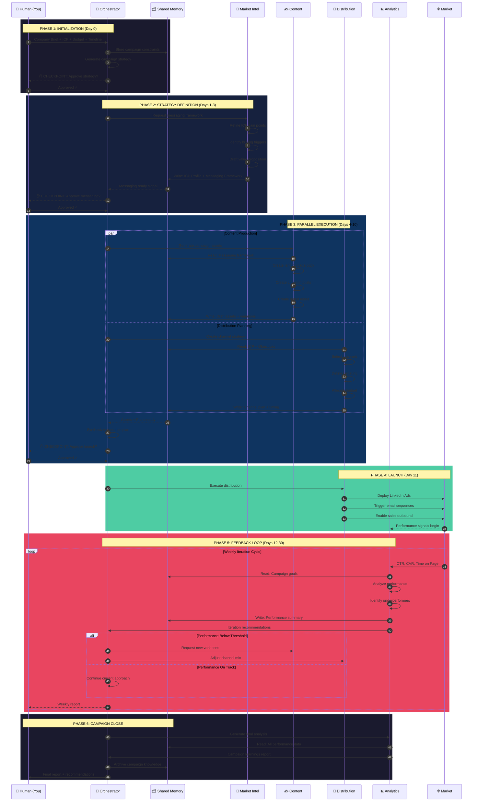

# PulsePilot Workflow Architecture

## System Overview

```mermaid
flowchart TB
    subgraph INPUTS["📥 INPUTS"]
        CB[Company Brief]
        ICP_IN[ICP Definition]
        BUD[Budget Constraints]
        TIME[Timeline]
    end

    subgraph ORCHESTRATOR["🧭 AGENT 0: MARKETING ORCHESTRATOR"]
        direction TB
        ORC_THINK["Strategic Thinking Layer"]
        ORC_DECIDE["Decision & Delegation"]
        ORC_SYNTH["Output Synthesis"]

        ORC_THINK --> ORC_DECIDE --> ORC_SYNTH
    end

    subgraph SPECIALISTS["⚡ SPECIALIST AGENTS"]
        direction LR

        subgraph A1["🧠 AGENT 1"]
            A1_TITLE["Market Intelligence"]
            A1_T1["Refine ICP Pain Points"]
            A1_T2["Identify Buying Triggers"]
            A1_T3["Draft Value Prop"]
            A1_T4["Message Hierarchy"]
        end

        subgraph A2["✍️ AGENT 2"]
            A2_TITLE["Content Production"]
            A2_T1["Landing Page Copy"]
            A2_T2["LinkedIn Posts"]
            A2_T3["Gated Assets"]
            A2_T4["A/B Variations"]
        end

        subgraph A3["📣 AGENT 3"]
            A3_TITLE["Distribution & Growth"]
            A3_T1["Channel Selection"]
            A3_T2["Audience Targeting"]
            A3_T3["Budget Allocation"]
            A3_T4["Rollout Sequencing"]
        end

        subgraph A4["📊 AGENT 4"]
            A4_TITLE["Analytics & Learning"]
            A4_T1["Define KPIs"]
            A4_T2["Monitor Signals"]
            A4_T3["Identify Failures"]
            A4_T4["Recommend Changes"]
        end
    end

    subgraph MEMORY["🗂️ SHARED MEMORY - Single Source of Truth"]
        direction LR
        MEM_BRAND["Brand Voice Rules"]
        MEM_ICP["ICP Definition"]
        MEM_MSG["Messaging Hierarchy"]
        MEM_CLAIMS["Approved Claims"]
        MEM_PERF["Performance Data"]
        MEM_ASSETS["Draft Assets"]
        MEM_CHANNEL["Channel Plans"]
    end

    subgraph OUTPUTS["📤 CAMPAIGN OUTPUTS"]
        OUT_STRAT["Campaign Strategy Doc"]
        OUT_ASSETS["Approved Assets"]
        OUT_PLAN["Execution Plan"]
        OUT_REPORT["Performance Reports"]
    end

    subgraph MARKET["🌐 MARKET EXECUTION"]
        LAUNCH["Campaign Launch"]
        LINKEDIN["LinkedIn Ads"]
        EMAIL["Email Sequences"]
        OUTBOUND["Sales Enablement"]
    end

    %% Input flows
    INPUTS --> ORCHESTRATOR

    %% Orchestrator delegates to specialists
    ORC_DECIDE -->|"Delegate Strategy"| A1
    ORC_DECIDE -->|"Delegate Creative"| A2
    ORC_DECIDE -->|"Delegate Distribution"| A3
    ORC_DECIDE -->|"Delegate Analytics"| A4

    %% Agent 1 feeds others (dependency)
    A1 -->|"Messaging Framework"| MEMORY

    %% Parallel agents read/write memory
    A2 <-->|"Read Messaging / Write Assets"| MEMORY
    A3 <-->|"Read ICP+Assets / Write Plans"| MEMORY
    A4 <-->|"Read Goals / Write Learnings"| MEMORY

    %% Memory feeds back to orchestrator
    MEMORY -->|"Synthesize"| ORC_SYNTH

    %% Outputs
    ORCHESTRATOR --> OUTPUTS
    OUTPUTS --> MARKET

    %% Feedback loop
    MARKET -->|"Performance Signals"| A4
    A4 -->|"Iteration Recommendations"| ORCHESTRATOR

    %% Styling
    classDef orchestrator fill:#1a1a2e,stroke:#e94560,stroke-width:3px,color:#fff
    classDef specialist fill:#16213e,stroke:#0f3460,stroke-width:2px,color:#fff
    classDef memory fill:#0f3460,stroke:#e94560,stroke-width:2px,color:#fff
    classDef input fill:#1a1a2e,stroke:#4ecca3,stroke-width:2px,color:#fff
    classDef output fill:#1a1a2e,stroke:#4ecca3,stroke-width:2px,color:#fff
    classDef market fill:#0f3460,stroke:#4ecca3,stroke-width:2px,color:#fff

    class ORCHESTRATOR orchestrator
    class A1,A2,A3,A4 specialist
    class MEMORY memory
    class INPUTS input
    class OUTPUTS output
    class MARKET market
```

## 30-Day Campaign Execution Flow

```mermaid
sequenceDiagram
    autonumber

    participant H as 👤 Human (You)
    participant O as 🧭 Orchestrator
    participant M as 🗂️ Shared Memory
    participant A1 as 🧠 Market Intel
    participant A2 as ✍️ Content
    participant A3 as 📣 Distribution
    participant A4 as 📊 Analytics
    participant MKT as 🌐 Market

    rect rgb(26, 26, 46)
        Note over H,O: PHASE 1: INITIALIZATION (Day 0)
        H->>O: Company Brief + ICP + Budget + Timeline
        O->>M: Store campaign constraints
        O->>O: Generate campaign strategy
        O-->>H: ✋ CHECKPOINT: Approve strategy?
        H->>O: Approved ✓
    end

    rect rgb(22, 33, 62)
        Note over O,A1: PHASE 2: STRATEGY DEFINITION (Days 1-3)
        O->>A1: Request messaging framework
        A1->>A1: Refine ICP pain points
        A1->>A1: Identify buying triggers
        A1->>A1: Draft value proposition
        A1->>M: Write: ICP Profile + Messaging Framework
        M-->>O: Messaging ready signal
        O-->>H: ✋ CHECKPOINT: Approve messaging?
        H->>O: Approved ✓
    end

    rect rgb(15, 52, 96)
        Note over A2,A3: PHASE 3: PARALLEL EXECUTION (Days 4-10)

        par Content Production
            O->>A2: Generate campaign assets
            A2->>M: Read: Messaging framework
            A2->>A2: Create landing page copy
            A2->>A2: Create LinkedIn posts
            A2->>A2: Create gated asset
            A2->>M: Write: Draft assets + variations
        and Distribution Planning
            O->>A3: Create channel strategy
            A3->>M: Read: ICP + Objectives
            A3->>A3: Select channels
            A3->>A3: Define targeting
            A3->>A3: Allocate budget
            A3->>M: Write: Channel plan + timing
        end

        M-->>O: Assets + Plans ready
        O->>O: Synthesize execution plan
        O-->>H: ✋ CHECKPOINT: Approve launch?
        H->>O: Approved ✓
    end

    rect rgb(78, 204, 163)
        Note over A3,MKT: PHASE 4: LAUNCH (Day 11)
        O->>A3: Execute distribution
        A3->>MKT: Deploy LinkedIn Ads
        A3->>MKT: Trigger email sequences
        A3->>MKT: Enable sales outbound
        MKT-->>A4: Performance signals begin
    end

    rect rgb(233, 69, 96)
        Note over A4,O: PHASE 5: FEEDBACK LOOP (Days 12-30)

        loop Weekly Iteration Cycle
            MKT->>A4: CTR, CVR, Time on Page
            A4->>M: Read: Campaign goals
            A4->>A4: Analyze performance
            A4->>A4: Identify underperformers
            A4->>M: Write: Performance summary
            A4->>O: Iteration recommendations

            alt Performance Below Threshold
                O->>A2: Request new variations
                O->>A3: Adjust channel mix
            else Performance On Track
                O->>O: Continue current approach
            end

            O-->>H: Weekly report
        end
    end

    rect rgb(26, 26, 46)
        Note over H,M: PHASE 6: CAMPAIGN CLOSE
        O->>A4: Generate final analysis
        A4->>M: Read: All performance data
        A4->>O: Campaign learnings report
        O->>M: Archive campaign knowledge
        O->>H: Final report + recommendations
    end
```
